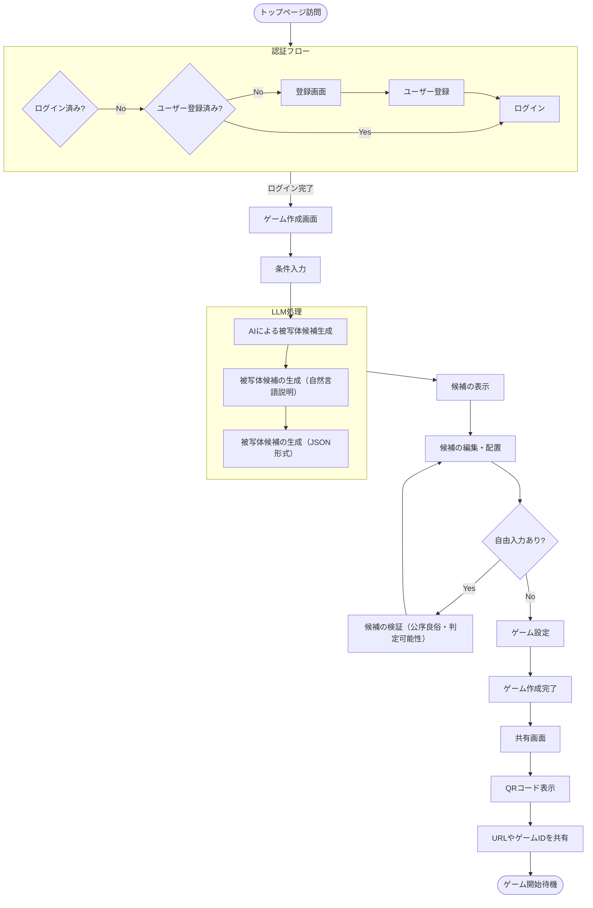
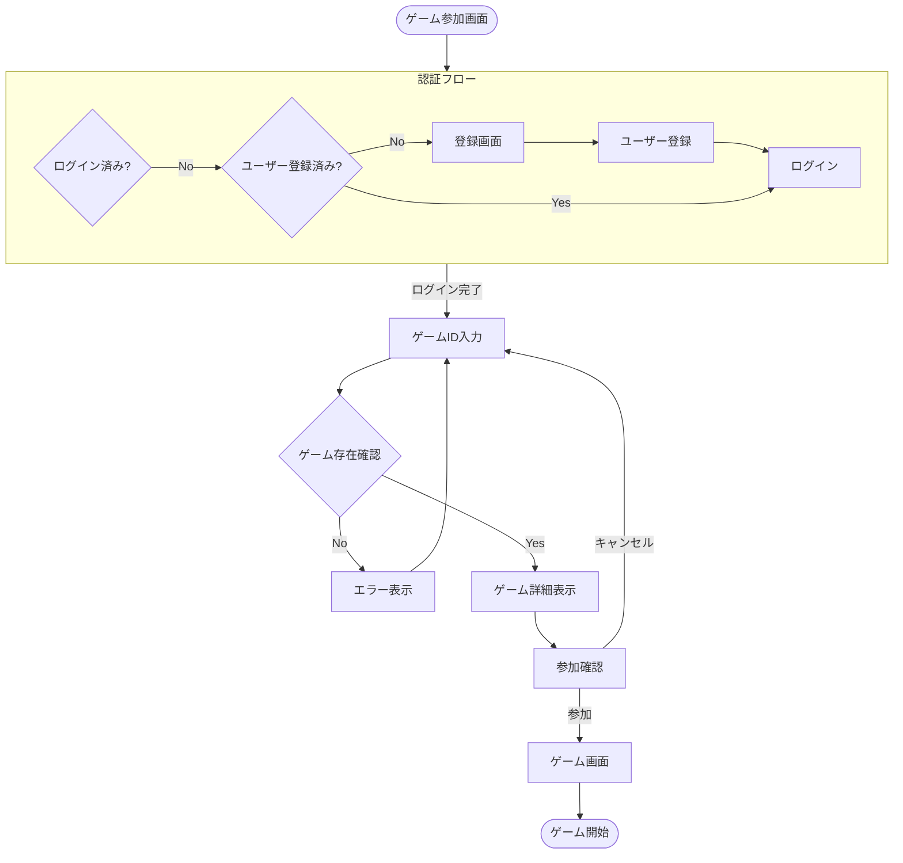
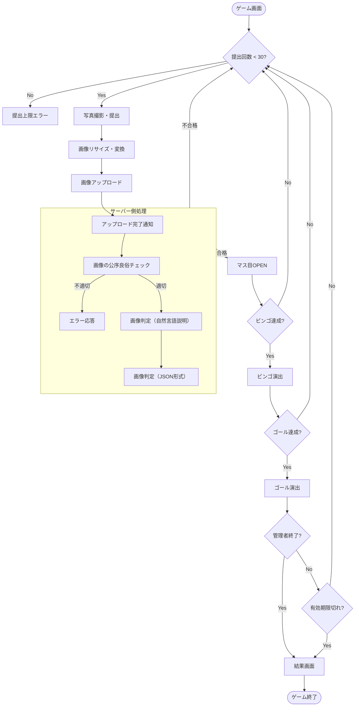
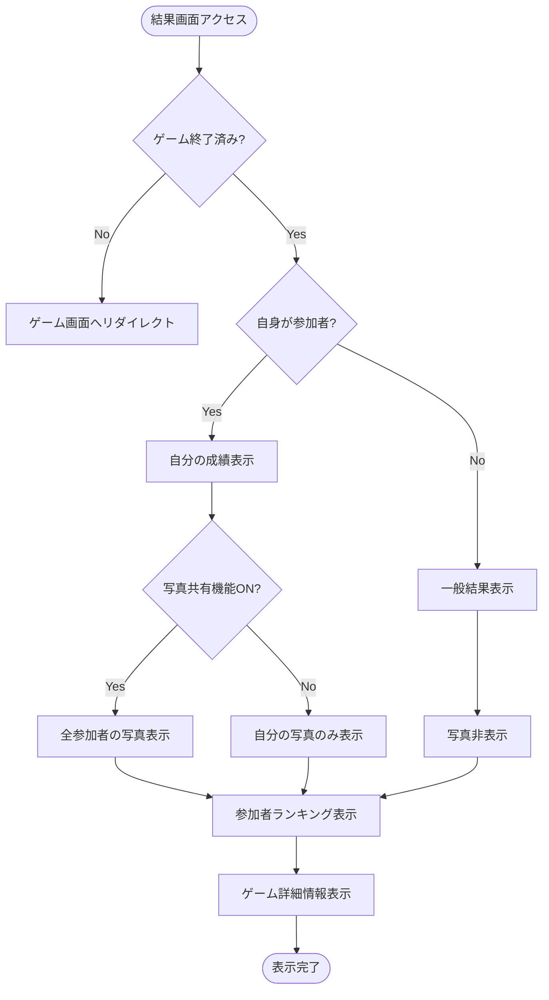
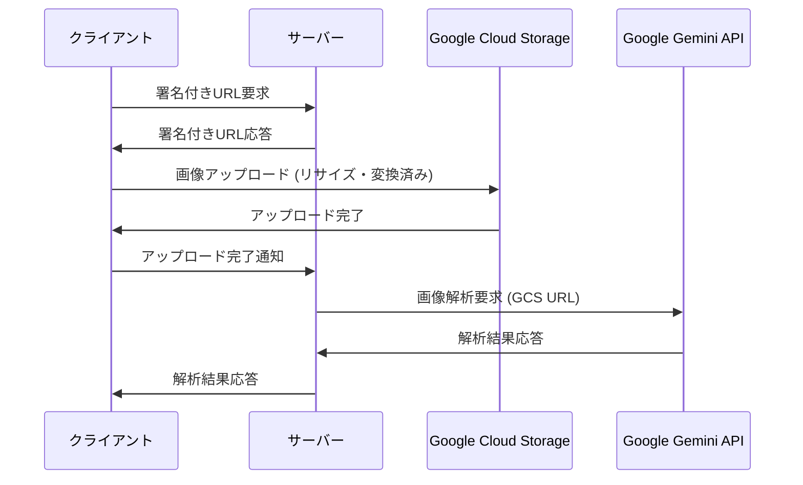

# Pingo

AIによる画像判定を用いたビンゴゲームの再発明。
友人や家族との集まり、イベント、教育現場など、様々な場面で使用できるエンターテイメントツール。

## 機能概要

### ゲームのルール

- 5x5のマス目を持つビンゴゲーム、中央のFreeを除く24マスには「赤い車」「工事現場の看板」「笑っている人」などの被写体の候補となる単語が並ぶ
- ゲーム参加者はそれらのマスに対してスマートフォンで写真を撮ってアップロード
- アップロードされた画像をAIが判定し、該当する被写体のマスがあったらOPENする
  - AIがどのように写真を解釈したかを毎回ユーザに提示し返すことで、写真の撮り方を徐々に工夫してもらう
  - AIによる判定は確信度が設定された閾値以上を合格とする（デフォルトは0.5）
  - 確信度の閾値はゲーム作成時に設定でき、ゲーム中でも管理者が調整可能
- 撮影とアップロードを繰り返し、通常のビンゴ同様に列を揃えることを目指す

### ユーザ

ユーザは基本となる「プレイヤー」エンティティと、ゲームごとに割り当てられる「ロール」の概念で整理する。

#### プレイヤー（基本エンティティ）

- プレイヤー登録は"ユーザーネーム"と"パスワード"を必須とし、実名や性別、メールアドレスは求めない
- 登録時に用いたユーザーネームとパスワードを用いたログイン/ログアウト
  - 参加の障壁をなるべく下げるのと、個人情報をシステムが持たないで済むようにするため
  - パスワードを忘れた場合は、再登録が必要となる
  - 最終ログインから1年以上経過したユーザーデータは削除される
- プレイヤー登録時にシステム内ではUUIDv4でプレイヤーIDを発番し、Firestoreで管理
- ユーザーネームはシステム内でユニークでなければならない
  - ユニークであるならば後から変更することも可能とする
- ログイン状態は1週間保持される
- 認証にはFirebase Authenticationを使用し、ユーザーネーム+パスワードの認証フローを実装する

#### ユーザロール

プレイヤーはゲームごとに以下のいずれかのロールを持つ：

- ゲーム作成者: ゲームを作成したプレイヤー。自動的にそのゲームの管理者および参加者となる
- ゲーム管理者: ゲーム作成者から権限を付与されたプレイヤー。以下の権限を持つ
  - ゲームの状況をリアルタイムにモニター（参加者数、提出写真、写真提出数、ビンゴ達成数）
  - ゲームの有効期限変更（最長で作成時から1週間まで）
  - ゲームの早期終了
  - ゲームの公開/非公開状態の切り替え（ゲーム開始後も可能）
- ゲーム参加者: ゲームに参加しているプレイヤー

一人のプレイヤーは複数のゲームに異なるロールで参加できる。データモデルとしては、プレイヤーとゲームの関係を表す中間テーブルでロールを管理する。

### ゲームの作成

- ゲームは作成されるとアルファベット大文字6桁（例 `ABCDEF` ）のユニークなIDが発番される
  - ユーザに直接入力されることを考慮し、小文字や数字は使わない
- ゲーム作成時に「場所またはテーマ」、「難易度」などを入力することで、どのような被写体が良いかLLMが24個プラスアルファの候補を提案
  - 被写体は画像判定AIが判定しやすいものでなければならないので、候補生成プロンプトに工夫が必要
- ゲーム作成者はLLMによって提案された候補に加えて、自身で考案（自由入力）した候補を並び替えて最終的な24個のマスと配置を決定
  - 自由入力した候補が画像判定AIによって判定できそうかを検討するとともに、公序良俗に反する内容でないかもLLMに再チェックさせる
- ゲームごとに「何列揃えたらゴールとするか」（デフォルトは1列、最大5列）を設定
- ゲームごとに「AIの判定確信度の閾値」（デフォルトは0.5）を設定
- ゲーム作成時に「提出された写真の共有」可否を選択し、「共有」になっている場合は、ゲーム参加者が互いの提出した写真をゲーム中およびゲーム後に見ることができるようになる
  - 写真共有設定がオフのゲームでは管理者も他の参加者の写真を見ることができない
  - 写真共有可能となったゲームはゲーム参加時に「このゲームで提出した写真は他のユーザも見ることができます」と注意喚起する必要あり
- ゲーム作成時にゲームの公開/非公開を選択
  - 「公開」されたゲームはゲーム参加画面の公開ゲーム一覧に列挙される
- ゲーム作成時にゲームの有効期限（最長で1週間、最短で1時間、デフォルトで24時間）を設定する
- ゲーム作成時にゲーム参加者も読むことのできる「備考」を設定することができる

#### 入力項目

- タイトル - ゲームのタイトル
- 場所またはテーマ - 被写体候補の生成に使用
- 難易度 - 被写体候補の生成に影響（撮影しやすさ/しにくさ）
- AIの判定確信度の閾値 - デフォルトは0.5、ゲーム中でも管理者が調整可能
- 何列揃えたらゴールとするか - 1列（デフォルト）〜5列（最大）
- 提出された写真の共有可否 - ON/OFFの選択
- 公開/非公開 - 公開ゲーム一覧に表示するかどうか
- 有効期限 - 1時間（最短）〜1週間（最長）、デフォルトは24時間
- 備考 - ゲーム参加者も読むことができる追加情報

### ゲームの共有

- ゲームの作成に成功すると、ゲームごとのユニークなURLにアクセスできるQRコードが表示される
- ゲームに参加するにはQRコードを読み取るか、ゲーム参加画面でゲームIDを直接入力するか、公開ゲームの一覧から選択する

#### ゲームへの参加

- ログインしているプレイヤーはゲームIDの入力や公開ゲームの一覧からの選択を以てゲームに参加できる
  - プレイヤーは同時に最大5つのアクティブなゲームに参加できる
  - プレイヤーは自分が参加している、または参加していたゲームの履歴を一覧、選択できる
- 一つのゲームに参加できる最大人数は50人（主に教育現場での利用を想定）

#### ゲーム中

- ゲーム参加者はゲームごとに写真の提出可能回数は30回とし、自分があと何回提出できるかを常時確認できる
  - 提出可能回数に制限を設けるのは画像判定AIの濫用を防ぐため
- 写真の提出時にクライアント側で画像のJPG化とリサイズを行い、画像判定AIに適した画像にしてからアップロードする
  - 提出できる画像の形式はJPG、PNG、HEICとし、動画やライブ写真は選択できないようにする
- ゲームが写真共有可能と設定されていた場合、ゲーム参加者は自分が提出した写真も含め、他の参加者がどのような写真を提出しているかを閲覧することができる
- ビンゴの列を揃えると、揃えた時間がサーバ側にも記録され、画面にも表示される
- 設定された列数を揃えるとゴール演出が表示される

### ゲームの終了と結果

- ゲームごとの有効期限を迎えたか、管理者によって終了されたゲームは写真選択ができなくなる
- 指定した列数を揃えた参加者の名前と揃えた日時が表彰される
- ゲームが写真共有可能と設定されていた場合、ゲームに参加していたプレイヤーは終了後もゲームに対して提出された画像を閲覧することができる
- アップロードされた画像はゲーム終了後も1年間保持される

## ユーザーフロー

### ゲーム作成フロー



### ゲーム参加フロー



### ゲームプレイフロー



### ゲーム結果表示フロー



## 技術スタック

- Docker -> Google Cloud Run
- Node.js 22
  - Next.js (App Router)
    - TypeScript 5
    - React 19
    - Tailwind CSS 4
  - Biome.js
  - Storybook
  - Vitest
- Lefthook

- ストレージ: Google Cloud Storage
- データベース: Firestore
- 認証: Firebase Authentication
- リアルタイム通知: Firestoreリアルタイムリスナー
- LLM (Google Gemini API):
  - ゲーム作成時の被写体候補生成（自然言語での説明）
  - ゲーム作成時の被写体候補生成（JSON形式でのデータ）
  - 自由入力された候補の検証結果（JSON形式でのデータ、公序良俗チェックと判定可能性）
  - 提出画像の判定（自然言語での説明）
  - 提出画像の判定（JSON形式でのデータ）
  - 提出された画像が公序良俗に反しないかの検証（JSON形式でのデータ）

## UI

ゲームの性質上、スマートフォンでの利用を主眼とし、解像度の小さい環境でも問題なく遊べるように十分配慮する。
対象ユーザには子どもや高齢者を含むため、極端に小さなフォントなどは使用を避ける。
全体的に可愛らしいトーン&マナーとしたいので、ダークモードはあえて用意しない。

### デザインシステム

#### カラーパレット

基本構成色として以下の4色を使用する：

- #08d9d6 (プライマリ)
- #252a34 (フォアグラウンド)
- #ff2e63 (セカンダリ/アクセント)
- #eaeaea (バックグラウンド)

これらの色はglobals.cssでテーマ変数として定義され、各カラーのバリエーション（50-950）も用意する。

#### タイポグラフィ

- 基本フォント: 「M PLUS Rounded 1c」（丸みを帯びた可愛らしいフォント）
- コード/数字用フォント: 「M PLUS 1 Code」（ゲームIDなど等幅表示が必要な箇所）

#### レスポンシブデザイン

- モバイルファーストで設計し、Tailwind CSSの標準ブレークポイントを使用
- PCからのアクセスには背景を拡大するのみで、基本的にモバイルと同じレイアウトを適用

#### アクセシビリティ

- 色覚異常者への配慮：選定した4色のコントラスト比を確認し、WCAG AAレベルを満たす
- スクリーンリーダー対応：適切なaria属性を使用
- タッチターゲットは最低44x44pxを確保し、操作性を向上

#### ユーザー体験

- ローディング状態：スピナーやスケルトンUIを使用し、ユーザーに処理中であることを明示
- エラー表示：統一されたデザインでエラーメッセージを表示
- アニメーション：過度なアニメーションは避け、機能性を重視した適度なトランジションを使用

### 画面

#### `/`

トップページ。
Pingoの概要を説明。
ログインしていれば `/new` と `/join` へのリンクを表示し、ログインしていなければ `/register` への遷移を促す。

#### `/register`

ユーザの新規登録画面。
ハンドルネーム、パスワードの入力と利用規約への同意を求める。

#### `/[userId]`

#### `/[userId]/edit`

ハンドルネーム、パスワードの編集。

#### `/new`

ゲームの新規作成画面。
ゲーム設定を入力し、「AIによって候補を生成」すると被写体候補が列挙される。
ビンゴカードが常時プレビュー表示されている。

#### `/join`

ゲームへの参加画面。
ゲームIDの直接入力に加えて、自身が参加しているゲームの最新10件と公開ゲームの最新10件を表示。
当該ゲーム画面に遷移する前にビンゴカードのプレビューとゲームの詳細を表示し、本当に参加するかを確認する。

#### `/game/[gameId]`

ゲーム画面。
ゲームのタイトルや作者、有効期限といったゲームの概要が表示され、その下に進行中のビンゴカード、さらにその下に画像の提出フォーム。
画像をアップロードした際のLLMからの応答は画像提出フォーム下部に表示される。
最下部に当該ゲームに参加している他のプレイヤーのハンドルネームなど最上部で表示しなかったゲームの詳細情報。

#### `/game/[gameId]/share`

ゲームの共有画面。
ゲームの作成が成功した際に自動的に遷移する。
ゲームの詳細とQRコードが表示される。

#### `/game/[gameId]/result`

ゲーム結果確認画面。
終了したゲームの `/game/[gameId]` にアクセスした際に自動的に遷移。
一方、終了していないゲームに対して `/game/[gameId]/result` にアクセスした場合は `/game/[gameId]` へリダイレクト。
ゲームの詳細とビンゴカードのプレビュー、自分が提出した画像に加え、写真共有可能なゲームだった場合には他のユーザによって提出された画像も表示。

#### `/game/[gameId]/admin`

ゲームの管理画面。
管理者になっていないゲームに対してアクセスした場合は `/game/[gameId]` へリダイレクト。
ゲームの詳細情報を表示し、有効期限や公開/非公開が編集できる。
ゲームの進捗情報をリアルタイムに更新。

#### `/privacy`

プライバシーポリシー。
具体的な文面は検討中だが、複数のデプロイ先によって切り替える可能性あり。
（例えば、企業タイアップした場合など、基本文面に加えて、各企業の文面を追加するなど）

#### `/terms`

サービス利用規約。
文面は検討中だが、複数のデプロイ先によって切り替える可能性あり。
（プライバシーポリシー同様、企業タイアップした場合など、基本文面に加えて、各企業の文面を追加するなど）

#### `/contact`

運営会社への連絡フォーム。

#### `/error`

何らかのエラーが生じた場合に遷移し、エラーの詳細を表示する。

#### `/config`

システム管理者だけがアクセスできるシステム管理ページ。
システム管理パスワードで認証。
詳細は追って検討。

#### `/health`

Cloud Runのヘルスチェック向けページ。
Node.js、Next.js、Reactなど主要ライブラリのバージョン情報とCPU割り当て、メモリ使用量などのリソース情報。

### コンポーネント

分割統治を意識し、それぞれのコンポーネントが部品として様々な組み合わせに耐えるよう設計したい。
`Button` や `InputField` などシステム内のあちこちで使われる基本コンポーネントに加え、以下、現時点で必要になるだろうと考えている基本UI要素と複合コンポーネントの例。

#### 基本UI要素

- **Modal** - ログイン/ログアウトなどのモーダル表示用の基本コンポーネント
- **Tooltip** - ヘルプテキストやヒントを表示するためのツールチップ
- **Tabs** - 複数のタブを切り替えて表示するためのコンポーネント（例：ゲーム参加画面での「参加中のゲーム」と「公開ゲーム」の切り替え）
- **Dropdown** - ドロップダウンメニュー（例：通知一覧表示）
- **Toggle** - ON/OFFの切り替え（例：写真共有機能の設定）
- **Slider** - 数値の範囲選択（例：AIの判定確信度の閾値設定）

#### 機能コンポーネント

- **Countdown Timer** - ゲームの有効期限表示用
- **Confirmation Dialog** - 確認ダイアログ（例：ゲーム終了の確認）
- **Loading Indicator** - ローディング表示（スピナーやスケルトンUI）
- **Error Boundary** - エラー発生時のフォールバックUI表示

#### 複合コンポーネント

##### Header

システム名 `Pingo` を中央に配置し、右上に「言語切り替え」、「通知アイコン」、「ハンバーガーメニュー」
ハンバーガーメニューから「ログイン/ログアウト」（モーダル表示）、「ユーザーネームの編集」「参加履歴の閲覧」「提出写真の一覧」
通知アイコンをクリックすると、ドロップダウンで直近10件の通知を表示する

##### Footer

Copyright表記に加えて、 `/privacy` `/terms` `contact` へのリンク。

##### Notification Toast

システムからの通知を表示するトースト。
指定時間後にフェードアウト。
指定時間を待たずに消すためのクローズボタン付き。

「ログインしました」「ログアウトしました」「ゲーム XXXXXX が作成されました」「ゲーム XXXXXX に参加しました」「ゲーム XXXXXX の管理者になりました」「"赤い車"が"名無しの権兵衛"によって初めてOPENになりました」などを想定。

通知はFirestoreリアルタイムリスナーを使用して実装し、ユーザーごとの通知コレクションを監視することでリアルタイムに表示する。

**実装上の懸念点**:

- 複数の通知が同時に発生した場合のキューイングと表示制御が必要。
- 通知の表示時間と消去タイミングの適切な設定。
- モバイルデバイスでの表示位置とサイズの最適化。
- Firestoreリアルタイムリスナーの効率的な設計と接続管理。

##### Image pop-up

ビンゴの列をそろえた時や、提出した画像が合格した場合、または不合格だった場合に最前面に表示されるポップアップ。
デバイスの解像度に合わせて自動サイズ調整し、画面中央に表示。
指定時間後にフェードアウト。
指定時間を待たずに消すためのクローズボタン付き。

「Bingo!」「Clear!」「OK！」「NG！」などを想定。
画像は透過PNGで用意する。

余力があれば、ブラウザのVibration APIを使って振動でも提示したい。

**実装上の懸念点**:

- 様々な画面サイズに対応するレスポンシブな表示設計。
- アニメーション（フェードイン・フェードアウト）の滑らかな実装。
- Vibration APIの対応ブラウザ確認と、非対応ブラウザでの代替表現の検討。
- 複数のポップアップが連続して発生した場合の表示制御。

##### User Register

ユーザ登録に必要な情報を入力するフォーム群。

##### User Login/Logout

ログインに必要な情報を入力するフォーム群。

##### Bingo Cell

ビンゴのマス目に相当するコンポーネント。
「撮影すべき被写体」を表示する。
初期状態の `CLOSE` と、達成済みの `OPEN` 、5x5中央に配置される `FREE` （ビンゴゲームにおける扱いとしては `OPEN` と同等）などの状態を持つ。
`OPEN` では、判定し合格となった画像が背景になる。

ゲームが写真共有可能と設定されていた場合は、押下することで、そのセルに対して合格した自分または他のプレイヤーの画像らをグリッド表示する。
つまり、そのセルを `OPEN` した他のプレイヤーがいるかをほぼリアルタイムに監視し、存在する場合は `HINTED` のような状態にする必要がある。

**実装上の懸念点**:

- リアルタイム更新の実装が複雑になる可能性がある。他のプレイヤーがセルをOPENした際のリアルタイム通知と状態更新には、Firestoreのリアルタイムリスナーを効率的に設計する必要がある。
- 複数のプレイヤーが同時に同じセルをOPENしようとした場合の競合解決が必要。

##### Bingo Board

Bingo Cellを5x5に配置。
`OPEN` 状態で縦、横、斜めにそろった列があればその列を強調表示。

**実装上の懸念点**:

- ビンゴ達成の判定ロジック（縦・横・斜めの列が揃ったかどうか）の実装が複雑になる可能性がある。
- 25個のセルの状態管理と、それに基づくビンゴ判定の効率的な実装が必要。

##### Image Submit

ゲーム参加者が画像を提出するためのフォーム。
画像を選択または撮影後にプレビューされると良い。

**実装上の懸念点**:

- クライアント側での画像のリサイズ、JPG化などの前処理が必要。
- モバイルデバイスでのカメラアクセス権限の取得と、撮影した画像の処理フローの設計が必要。
- アップロード中の進捗表示とエラーハンドリングが重要。
- 既存ライブラリ（browser-image-compression など）の活用を検討。

##### Image Grid

Bingo Cell押下時やゲーム終了後など、複数の画像を一覧するためのコンポーネント。
グリッド上にサムネイルを並べ、サムネイルを押下すると拡大表示する。

**実装上の懸念点**:

- 多数の画像を効率的に表示するための遅延読み込み（Lazy Loading）の実装が必要。
- サムネイルから拡大表示への遷移アニメーションの実装が複雑になる可能性がある。
- モバイルデバイスでの表示最適化（タッチジェスチャー対応など）が必要。

##### Subject Card

ゲーム作成時に被写体候補を編集するためのフォーム。
LLMによって挙げられた候補で初期化されたり、新規に作成されたり削除されたりする。
後述のリスト表示にて、ビンゴカードに`採用される` `採用されない` の2状態を持つ必要がある。
加えて、入力された被写体候補が公序良俗に反するような場合に `このままでは採用できない` という状態もあり得る。

**実装上の懸念点**:

- LLMとの連携が必要で、検証結果の表示方法が課題になる可能性がある。
- 複数の状態（採用される/採用されない/採用できない）の視覚的な表現方法の設計が必要。
- 自由入力された候補のリアルタイム検証とフィードバック表示の実装が必要。

##### Subjects List

Subject Cardを並べたリスト。
上記24件（5x5の中央のFreeを除くので）がBingo Cellになる `採用される` 状態となる。
並べ替えはドラッグ&ドロップでできると望ましい。
`採用される` Subject Cardが24件に満たない場合は警告表示する。

**実装上の懸念点**:

- ドラッグ&ドロップによる並べ替え機能の実装が複雑になる可能性がある。特にモバイルデバイスでのタッチ操作に対応する必要がある。
- 24個の被写体候補の配置を5x5のグリッドに視覚的にマッピングする方法を工夫する必要がある。
- ドラッグ&ドロップ機能には react-beautiful-dnd や react-sortable-hoc などのライブラリの活用を検討。

##### Game ID Input

アルファベット大文字6桁からなるゲームIDを入力するフォーム。
6文字入力であることがわかりやすいUIとなっているべき。
6文字入力したタイミングで、そのゲームが参加可能かをバリデーションし、参加不可能（ゲームが存在しない、ゲームが終了している等）で警告表示。

**実装上の懸念点**:

- 6文字入力を視覚的に明示するUI設計（例：6つの分割されたボックス）が必要。
- 入力中のリアルタイムバリデーション（大文字のみ許可、数字や記号を拒否）の実装。
- 入力完了時のFirestoreクエリによるゲーム存在確認と適切なフィードバック表示。

##### Game Card

ゲーム参加画面やプレイヤーごとの参加履歴にて、ゲームを列挙する際の各アイテム。
ゲームのタイトル、ゲームID、ゲームの状態、作者、作成日時、有効期限、備考などのゲームの概要を表示する。
ゲームの状態に応じて色味が変わる。
押下することで、そのゲーム画面に遷移する。

##### Game List

Game Cardを並べたリスト。
タイトルや作成日時、状態などでソートできると良い。

##### Game Detail

ゲーム中、またはゲーム管理画面にてゲームの詳細情報を表示するためのコンポーネント。
Game Cardより詳細な情報を表示する。
自身がそのゲームの管理者に含まれる場合は管理画面へのリンクが表示される。

##### Players List

ゲーム中に参加者の一覧を表示する際に使用するコンポーネント。
自身が管理者の場合は、参加者を選択して管理者に加えることができる。

##### QR Code

ゲームごとに生成されたURLへの遷移を助けるQRコード表示。
主にゲームの新規作成が成功した際に利用される。

**実装上の懸念点**:

- QRコード生成ライブラリ（qrcode.react など）の選定と実装。
- QRコードの適切なサイズ調整と解像度の確保。
- QRコードの保存・共有機能の実装（画像としてダウンロードなど）。

##### Speech Bubble

新規ゲーム作成時にLLMがどのように候補を推測したか、または画像判定AIが提出された画像をどのように解釈したか、などを表示する吹き出し。
「AIからの応答」を統一的なUIで提供する。
LLMからの応答はMarkdownである可能性が高いので、Markdownをそのままレンダリングできると良い。

**実装上の懸念点**:

- Markdownのレンダリングと、AIからの応答を適切に表示するためのスタイリングが必要。
- 長文の応答を適切に表示するためのスクロールやサイズ調整が必要。
- Markdownレンダリングには react-markdown などのライブラリの活用を検討。

## API

### 認証API

- ユーザー登録: `/api/auth/register`
- ログイン: `/api/auth/login`
- ログアウト: `/api/auth/logout`
- ユーザー情報更新: `/api/auth/update`

### ユーザーAPI

- ユーザー情報取得: `/api/users/[userId]`
- ユーザー参加履歴取得: `/api/users/[userId]/history`
- ユーザー通知一覧取得: `/api/users/[userId]/notifications`
- 通知既読設定: `/api/users/[userId]/notifications/[notificationId]/read`
- ユーザー画像一覧取得: `/api/users/[userId]/images` (自分がアップロードした全画像)

### ゲーム管理API

- ゲーム作成: `/api/games/create`
- ゲーム情報取得: `/api/games/[gameId]`
- ゲーム参加: `/api/games/[gameId]/join`
- ゲーム設定更新: `/api/games/[gameId]/update`
- ゲーム終了: `/api/games/[gameId]/end`
- 公開ゲーム一覧取得: `/api/games/public`
- 参加中ゲーム一覧取得: `/api/games/participating`
- 管理者追加: `/api/games/[gameId]/admins/add`
- 参加者一覧取得: `/api/games/[gameId]/participants`

### 画像処理API

- 署名付きURL取得: `/api/images/getUploadUrl` (GCSへの直接アップロード用)
- 画像処理: `/api/images/process` (アップロード完了通知と画像判定)
- ゲーム画像一覧取得: `/api/games/[gameId]/images` (写真共有設定に応じて全参加者または自分の画像のみ)
  - 自分の画像一覧: `acceptanceStatus != null && acceptanceStatus != "inappropriate_content"`
  - 他のプレイヤーの画像: `acceptanceStatus == "accepted"`
- セル画像一覧取得: `/api/games/[gameId]/cells/[cellId]/images` (特定のセルに対する画像)

#### 画像処理フロー



この方式のメリット:

- サーバーの負荷分散（画像データがサーバーを経由しない）
- クライアントからGCSへの直接アップロードによる高速化
- セキュリティ（署名付きURLは期限付きで特定の操作のみ許可）

## リアルタイム機能

Firestoreリアルタイムリスナーを使用して、以下の機能をクライアント側で実装：

- ゲーム状態更新の監視（ビンゴボードの状態変化）
- 新規参加者の監視
- 画像提出の監視
- ビンゴ達成の監視
- 通知コレクションの監視

これらの機能はサーバーサイドAPIを介さず、クライアントから直接Firestoreにアクセスする。
Firestoreのセキュリティルールを適切に設定し、認証済みユーザーのみが必要なデータにアクセスできるようにする。

## データモデル

### ユーザー(users)

```yaml
/users/
  /{userId}/
    - id: string (UUIDv4)
    - username: string (ユニークなユーザーネーム)
    - createdAt: timestamp
    - lastLoginAt: timestamp
    - participatingGames: array<string> (参加中のゲームID、最大5つ)
    - gameHistory: array<string> (過去に参加したゲームID)
    
    /notifications/
      /{notificationId}/
        - id: string
        - type: string (通知タイプ)
        - displayType: string ("toast" または "popup")
        - message: string (表示メッセージ)
        - createdAt: timestamp
        - read: boolean (既読フラグ)
        - relatedGameId: string (関連ゲームID、該当する場合)
        - details: map (通知タイプに応じた追加情報)

通知タイプ（type）の具体的な値：
- "login": ログイン通知
- "logout": ログアウト通知
- "game_created": ゲーム作成通知
- "game_joined": ゲーム参加通知
- "admin_granted": 管理者権限付与通知
- "cell_opened_by_other": 他のプレイヤーがセルをOPENした通知
- "cell_submission_success": 自身の提出画像が合格してセルがOPENした通知
- "cell_submission_failure": 自身の提出画像が不合格だった通知
- "bingo_achieved": ビンゴ達成通知
- "goal_achieved": ゴール達成通知
- "game_ended": ゲーム終了通知
```

### ゲーム参加(game_participations)

```yaml
/game_participations/
  /{participationId}/
    - userId: string (ユーザーID)
    - gameId: string (ゲームID)
    - role: string ("creator", "admin", "participant")
    - joinedAt: timestamp
    - completedLines: number (達成した列数)
    - lastCompletedAt: timestamp (最後に列を完成させた時間)
    - submissionCount: number (画像提出回数、最大30)
```

### ゲーム(games)

```yaml
/games/
  /{gameId}/
    - id: string (6文字のアルファベット大文字)
    - title: string (タイトル)
    - theme: string (場所やテーマ)
    - creatorId: string (作成者のユーザーID)
    - createdAt: timestamp
    - expiresAt: timestamp
    - isPublic: boolean
    - isPhotoSharingEnabled: boolean
    - requiredBingoLines: number (何列揃えたらゴールとするか、1-5)
    - confidenceThreshold: number (AIの判定確信度の閾値、デフォルト0.5)
    - notes: string (備考)
    - status: string ("active", "ended")
    
    /board/
      - cells: array<{
        id: string,
        position: {x: number, y: number} (0-4, 0-4の座標),
        subject: string (被写体の説明),
        isFree: boolean (中央のFREEセルかどうか)
      }> (ゲーム作成時に設定される共通のビンゴボード)
    
    /playerBoards/
      /{userId}/
        - userId: string (プレイヤーID)
        - cellStates: map<string, {
          isOpen: boolean (セルがOPENされているかどうか),
          openedAt: timestamp (OPENされた時刻、未OPENの場合はnull),
          openedBySubmissionId: string (OPENに至った提出ID、未OPENの場合はnull)
        }> (セルIDをキーとしたマップ)
        - completedLines: array<{
          type: string ("row", "column", "diagonal"),
          index: number (行/列のインデックス、対角線の場合は0または1),
          completedAt: timestamp (列が完成した時刻)
        }> (完成した列の情報)
    
    /participants/
      /{userId}/
        - id: string (ユーザーID)
        - joinedAt: timestamp
        - completedLines: number (達成した列数)
        - lastCompletedAt: timestamp (最後に列を完成させた時間)
        - submissionCount: number (画像提出回数、最大30)
    
    /submissions/
      /{submissionId}/
        - id: string
        - userId: string (提出したユーザーID)
        - imageUrl: string (Cloud Storageへのパス)
        - submittedAt: timestamp (アップロード完了時刻)
        - analyzedAt: timestamp (AI解析完了時刻)
        - aiResponse: string (AIの判定結果)
        - matchedCellId: string (AIが判定した合致するセルID、合致しない場合はnull)
        - confidence: number (AIの確信度)
        - processingStatus: string ("uploaded", "content_checking", "analyzing", "analyzed", "error")
        - acceptanceStatus: string (null, "accepted", "inappropriate_content", "no_match")
        - errorMessage: string (エラー発生時のメッセージ)
    
    /events/
      /{eventId}/
        - id: string
        - type: string (例: "join", "submit", "complete_line", "complete_game")
        - userId: string (イベント発生ユーザー)
        - timestamp: timestamp
        - details: map (イベント固有の詳細情報)
```

## ストレージ設計

Google Cloud Storageの階層機能を活用し、ゲームIDごとにフォルダを分けて画像を保存することでImage Listなどで列挙する際のクエリを効率化したい。

画像は以下の構造で保存する:

```yaml
/pingo-images/
  /{gameId}/
    /{userId}_{submissionId}.jpg
```

## 非機能要件

### 想定環境

スマートフォンからの利用がほとんどであり、特に日本においてはiPhoneからのアクセスが多いと想定。
よって、iOS Safariでの完全動作は必須。
次点でAndroid Chromeとし、現行から過去3年程度までの機種およびブラウザをカバーしたい。

### パフォーマンス要件

- 画像判定の応答時間: 3秒以内を目標、最大5秒まで許容
- ページロード時間: 2秒以内
- 一つのゲームに参加できる最大人数: 50人
- 同時アクセスユーザー数: 最大500人を想定

### 多言語対応

日英の2ヶ国語対応とする。
デフォルトロケールは日本語とする。
日本語は他の言語と比べて比較的サイズを取る傾向があるため、日本語で破綻しないUIを作成することで、英語対応が楽になると期待する。

#### 多言語対応の実装

- next-intl または react-i18next を使用して多言語対応を実装
- 翻訳リソースはJSON形式で管理し、言語ごとにファイルを分ける
- 言語切り替えはヘッダーに配置し、選択した言語設定はlocalStorageに保存
- 初回アクセス時はブラウザの言語設定を検出し、対応する言語があればそれを適用
- 翻訳キーは階層構造を持たせ、画面やコンポーネントごとに整理
- 数値や日付のフォーマットも言語に応じて適切に表示（Intl APIを活用）

### セキュリティ

本システムではそもそも個人情報を扱わないが、データベースへの書き込み処理はAPIを介してサーバ側に集約するなどを意識して行う。
恐るべきは、ストレージやAIを目的外に濫用されることであり、APIキーの流出などはあってはならない。

#### セキュリティ対策

- **Firestoreセキュリティルール**: 適切なセキュリティルールを設定し、認証済みユーザーのみが必要なデータにアクセスできるようにする
  - ゲーム参加者は自分のプレイヤーボードのみ更新可能
  - ゲーム管理者のみがゲーム設定を更新可能
  - 写真共有設定がオフの場合、他のプレイヤーの画像は閲覧不可

- **API保護**:
  - CSRFトークンを使用してクロスサイトリクエストフォージェリを防止
  - レート制限を実装し、APIの過剰な使用を防止（特に画像判定API）
  - APIキーはサーバーサイドでのみ使用し、クライアントには公開しない

- **画像アップロードセキュリティ**:
  - アップロード前にクライアント側でファイルサイズと形式を検証
  - サーバー側でも再検証を行い、不正なファイルをブロック
  - 署名付きURLには短い有効期限を設定（5分程度）
  - アップロード可能なファイル形式を厳格に制限（JPG、PNG、HEICのみ）

- **認証セキュリティ**:
  - Firebase Authenticationを使用した安全な認証
  - パスワードの強度要件を設定（最低8文字、英数字混在など）
  - ログイン試行回数の制限を実装

### 演出

エンターテイメントアプリなので、アニメーションやトランジションが使えるところは積極的に使っていく。
一方、ブラウザアプリであり、どのような環境で利用されるかも想定しきれないため、BGMや効果音は用意しない。

#### トランジションとアニメーション

View Transition APIを活用したトランジションを実装する。

**ブラウザサポート状況（2025年4月現在）**:

- Chrome: サポート
- Edge: サポート
- Safari (iOS含む): サポート
- Firefox: サポートなし

**Next.jsでの実装**:

- Next.jsの実験的機能としてサポートされている
- `next.config.js`で`experimental.viewTransition`を有効化する必要がある
- 参考: [Next.js公式ドキュメント](https://nextjs.org/docs/app/api-reference/config/next-config-js/viewTransition)

**実装アプローチ**:

- View Transition APIを基本的なトランジション方法として採用
- Firefoxユーザー向けにはCSS Animationsによるフォールバックを実装
- 主要なトランジション箇所:
  - ページ間の遷移（特にゲーム参加時やゲーム結果表示時）
  - ビンゴセルのOPEN/CLOSE状態の切り替え
  - 画像アップロード時の状態変化
  - 通知の表示/非表示
  - モーダルやポップアップの表示/非表示

## 開発管理

まずは1ヶ月後の6月末を目安にMVPの完成を目指し、MVPの完成をマイルストーン「Version 1.0」と呼称する。
Version 1.0の時点で、自動テストのカバレッジは `70%` を目標とする。

全てのタスクはGitHub Issueで管理され、着手優先度に応じて、Version 0.8、0.9、1.0、1.1、2.0を設定する。
マイルストーンはすでにGitHub上に準備済み。
GitHubのIssue Templateは `.github/ISSUE_TEMPLATE/feat.md` `.github/ISSUE_TEMPLATE/fix.md` に用意した。

## 要検討事項

- [x] しばらくはCloud Runから発行されるURLを本番環境URLとし、将来的にはドメインを取得、設定したい
- [x] CI/CDについて、GitHub mainブランチへのPushをトリガーに動くGoogle Cloud Buildを用意してCloud Runにデプロイ
  - [x] デプロイ以外の自動テストや静的解析にはGitHub Actionsを活用したい → Version 0.8でYAMLファイルを用意し、開発の進行に合わせて拡充
- [x] テスト時にデータベースやストレージに作成されるテストデータを一括で削除する機能が欲しい → テスト用プレフィックスを使用し、クリーンアップスクリプトを早期に実装
- [x] 認証の実装にはNextAuth.jsを利用した方が良いか → 認証の実装にはFirebase Authenticationを利用する
- [x] 状態管理はReact Context APIで良いか → 本システムはそれほど複雑な状態管理が必要にならないと思われるので、React Context APIで決定
- [x] バナー広告を掲載し、クラウド利用料の足しにしたい → 少なくともVersion 1.0では見送り
- [x] Google Analyticsを導入し、アクセス解析を行いたい → Google Analytics 4を導入することで決定

## 備考

初版: 2025/04/26
