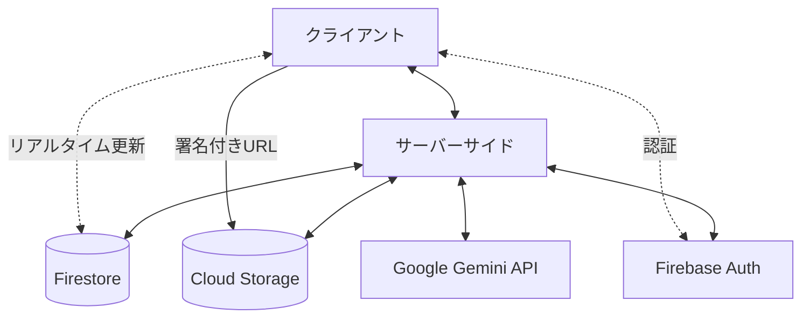
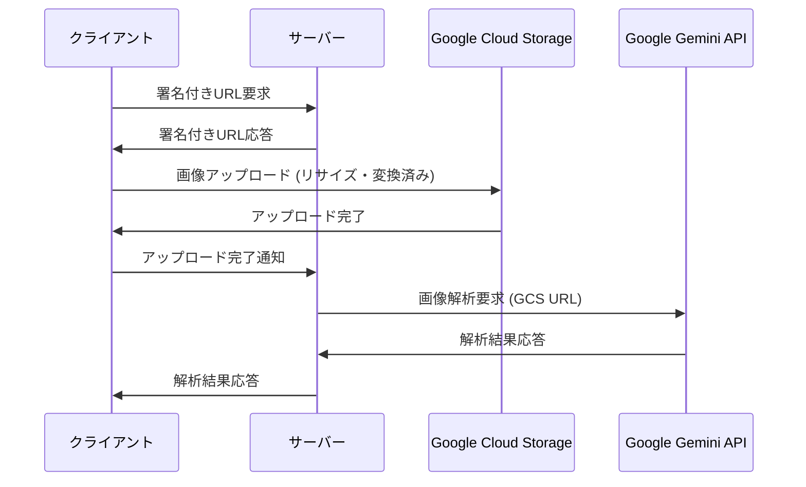

# 技術仕様書

## 技術スタック

### フロントエンド

- **フレームワーク**: Next.js (App Router)
- **言語**: TypeScript 5
- **UIライブラリ**: React 19
- **スタイリング**: Tailwind CSS 4
- **状態管理**: React Context API
- **多言語対応**: (T. B. D.)
- **アニメーション**: View Transition API

### バックエンド

- **ランタイム**: Node.js 22
- **デプロイ**: Docker → Google Cloud Run
- **データベース**: Firestore
- **ストレージ**: Google Cloud Storage
- **認証**: Firebase Authentication
- **AI/ML**: Google Gemini API

### 開発ツール

- **コード品質**: Biome.js
- **テスト**: Vitest (Browser Mode)
- **UIコンポーネント開発**: Storybook
- **Git フック**: Lefthook
- **CI/CD**: Google Cloud Build (デプロイ), GitHub Actions (テスト・静的解析)
- **分析**: Google Analytics 4

## システムアーキテクチャ

### 全体構成



### コンポーネント間の関係

- **クライアント**: ユーザーインターフェース、画像の前処理、リアルタイム更新の受信
- **サーバー**: API処理、ビジネスロジック、AIとの連携、データ検証
- **データベース**: ユーザー情報、ゲーム情報、ビンゴボード状態の保存
- **ストレージ**: 画像ファイルの保存
- **AI**: 画像判定、被写体候補生成、公序良俗チェック
- **認証**: ユーザー認証と権限管理

## データモデル

### ユーザー(users)

```yaml
/users/
  /{userId}/
    - id: string (UUIDv4)
    - handle: string (ユニークなハンドルネーム、表示名として)
    - createdAt: timestamp
    - lastLoginAt: timestamp
    - participatingGames: array<string> (参加中のゲームID、最大5つ)
    - gameHistory: array<string> (過去に参加したゲームID)
    
    /notifications/
      /{notificationId}/
        - id: string
        - type: string (通知タイプ)
        - displayType: string ("toast" または "popup")
        - message: string (表示メッセージ)
        - createdAt: timestamp
        - read: boolean (既読フラグ)
        - relatedGameId: string (関連ゲームID、該当する場合)
        - details: map (通知タイプに応じた追加情報)
```

### ゲーム参加(game_participations)

```yaml
/game_participations/
  /{participationId}/
    - userId: string (ユーザーID)
    - gameId: string (ゲームID)
    - role: string ("creator", "admin", "participant")
    - joinedAt: timestamp
    - completedLines: number (達成した列数)
    - lastCompletedAt: timestamp (最後に列を完成させた時間)
    - submissionCount: number (画像提出回数、最大30)
```

### ゲーム(games)

```yaml
/games/
  /{gameId}/
    - id: string (6文字のアルファベット大文字)
    - title: string (タイトル)
    - theme: string (場所やテーマ)
    - creatorId: string (作成者のユーザーID)
    - createdAt: timestamp
    - expiresAt: timestamp
    - isPublic: boolean
    - isPhotoSharingEnabled: boolean
    - requiredBingoLines: number (何列揃えたらゴールとするか、1-5)
    - confidenceThreshold: number (AIの判定確信度の閾値、デフォルト0.5)
    - notes: string (備考)
    - status: string ("active", "ended")
    
    /board/
      - cells: array<{
        id: string,
        position: {x: number, y: number} (0-4, 0-4の座標),
        subject: string (被写体の説明),
        isFree: boolean (中央のFREEセルかどうか)
      }> (ゲーム作成時に設定される共通のビンゴボード)
    
    /playerBoards/
      /{userId}/
        - userId: string (プレイヤーID)
        - cellStates: map<string, {
          isOpen: boolean (セルがOPENされているかどうか),
          openedAt: timestamp (OPENされた時刻、未OPENの場合はnull),
          openedBySubmissionId: string (OPENに至った提出ID、未OPENの場合はnull)
        }> (セルIDをキーとしたマップ)
        - completedLines: array<{
          type: string ("row", "column", "diagonal"),
          index: number (行/列のインデックス、対角線の場合は0または1),
          completedAt: timestamp (列が完成した時刻)
        }> (完成した列の情報)
    
    /participants/
      /{userId}/
        - id: string (ユーザーID)
        - joinedAt: timestamp
        - completedLines: number (達成した列数)
        - lastCompletedAt: timestamp (最後に列を完成させた時間)
        - submissionCount: number (画像提出回数、最大30)
    
    /submissions/
      /{submissionId}/
        - id: string
        - userId: string (提出したユーザーID)
        - imageUrl: string (Cloud Storageへのパス)
        - submittedAt: timestamp (アップロード完了時刻)
        - analyzedAt: timestamp (AI解析完了時刻)
        - aiResponse: string (AIの判定結果)
        - matchedCellId: string (AIが判定した合致するセルID、合致しない場合はnull)
        - confidence: number (AIの確信度)
        - processingStatus: string ("uploaded", "content_checking", "analyzing", "analyzed", "error")
        - acceptanceStatus: string (null, "accepted", "inappropriate_content", "no_match")
        - errorMessage: string (エラー発生時のメッセージ)
    
    /events/
      /{eventId}/
        - id: string
        - type: string (例: "join", "submit", "complete_line", "complete_game")
        - userId: string (イベント発生ユーザー)
        - timestamp: timestamp
        - details: map (イベント固有の詳細情報)
```

## API設計

### 認証API

- ユーザー登録: `/api/auth/register`
- ログイン: `/api/auth/login`
- ログアウト: `/api/auth/logout`
- ユーザー情報更新: `/api/auth/update`

### ユーザーAPI

- ユーザー情報取得: `/api/users/[userId]`
- ユーザー参加履歴取得: `/api/users/[userId]/history`
- ユーザー通知一覧取得: `/api/users/[userId]/notifications`
- 通知既読設定: `/api/users/[userId]/notifications/[notificationId]/read`
- ユーザー画像一覧取得: `/api/users/[userId]/images` (自分がアップロードした全画像)

### ゲーム管理API

- ゲーム作成: `/api/games/create`
- ゲーム情報取得: `/api/games/[gameId]`
- ゲーム参加: `/api/games/[gameId]/join`
- ゲーム設定更新: `/api/games/[gameId]/update`
- ゲーム終了: `/api/games/[gameId]/end`
- 公開ゲーム一覧取得: `/api/games/public`
- 参加中ゲーム一覧取得: `/api/games/participating`
- 管理者追加: `/api/games/[gameId]/admins/add`
- 参加者一覧取得: `/api/games/[gameId]/participants`

### 画像処理API

- 署名付きURL取得: `/api/images/getUploadUrl` (GCSへの直接アップロード用)
- 画像処理: `/api/images/process` (アップロード完了通知と画像判定)
- ゲーム画像一覧取得: `/api/games/[gameId]/images` (写真共有設定に応じて全参加者または自分の画像のみ)
  - 自分の画像一覧: `acceptanceStatus != null && acceptanceStatus != "inappropriate_content"`
  - 他のプレイヤーの画像: `acceptanceStatus == "accepted"`
- セル画像一覧取得: `/api/games/[gameId]/cells/[cellId]/images` (特定のセルに対する画像)

### 画像処理フロー



## リアルタイム機能

Firestoreリアルタイムリスナーを使用して、以下の機能をクライアント側で実装：

- ゲーム状態更新の監視（ビンゴボードの状態変化）
- 新規参加者の監視
- 画像提出の監視
- ビンゴ達成の監視
- 通知コレクションの監視

これらの機能はサーバーサイドAPIを介さず、クライアントから直接Firestoreにアクセスする。
Firestoreのセキュリティルールを適切に設定し、認証済みユーザーのみが必要なデータにアクセスできるようにする。

## ストレージ設計

Google Cloud Storageの階層機能を活用し、ゲームIDごとにフォルダを分けて画像を保存することでImage Listなどで列挙する際のクエリを効率化する。

画像は以下の構造で保存する:

```yaml
/pingo-images/
  /{gameId}/
    /{userId}_{submissionId}.jpg
```

## UI/UXデザイン

> [!NOTE]
> UI/UXの詳細な実装上の懸念点や各コンポーネントの詳細説明については、`./cline_docs/FirstPlot.md`を参照してください。

### デザインシステム

#### カラーパレット

基本構成色として以下の4色を使用する：

- #08d9d6 (プライマリ)
- #252a34 (フォアグラウンド)
- #ff2e63 (セカンダリ/アクセント)
- #eaeaea (バックグラウンド)

これらの色はglobals.cssでテーマ変数として定義され、各カラーのバリエーション（50-950）も用意する。

#### タイポグラフィ

- 基本フォント: 「M PLUS Rounded 1c」（丸みを帯びた可愛らしいフォント）
- コード/数字用フォント: 「M PLUS 1 Code」（ゲームIDなど等幅表示が必要な箇所）

#### レスポンシブデザイン

- モバイルファーストで設計し、Tailwind CSSの標準ブレークポイントを使用
- PCからのアクセスには背景を拡大するのみで、基本的にモバイルと同じレイアウトを適用

#### アクセシビリティ

- 色覚異常者への配慮：選定した4色のコントラスト比を確認し、WCAG AAレベルを満たす
- スクリーンリーダー対応：適切なaria属性を使用
- タッチターゲットは最低44x44pxを確保し、操作性を向上

### 画面設計

主要な画面は以下の通り：

1. トップページ (`/`)
2. ユーザー登録画面 (`/register`)
3. ユーザー情報画面 (`/[userId]`)
4. ユーザー編集画面 (`/[userId]/edit`)
5. ゲーム作成画面 (`/new`)
6. ゲーム参加画面 (`/join`)
7. ゲーム画面 (`/game/[gameId]`)
8. ゲーム共有画面 (`/game/[gameId]/share`)
9. ゲーム結果画面 (`/game/[gameId]/result`)
10. ゲーム管理画面 (`/game/[gameId]/admin`)
11. プライバシーポリシー (`/privacy`)
12. 利用規約 (`/terms`)
13. お問い合わせ (`/contact`)
14. エラー画面 (`/error`)
15. システム管理画面 (`/config`)
16. ヘルスチェック画面 (`/health`)

### コンポーネント設計

コンポーネントは以下のカテゴリに分類：

1. **基本UI要素**: Button, InputField, Modal, Tooltip, Tabs, Dropdown, Toggle, Slider
2. **機能コンポーネント**: Countdown Timer, Confirmation Dialog, Loading Indicator, Error Boundary
3. **複合コンポーネント**: Header, Footer, Notification Toast, Image pop-up, User Register, User Login/Logout, Bingo Cell, Bingo Board, Image Submit, Image Grid, Subject Card, Subjects List, Game ID Input, Game Card, Game List, Game Detail, Players List, QR Code, Speech Bubble

## トランジションとアニメーション

View Transition APIを活用したトランジションを実装する。

**ブラウザサポート状況（2025年4月現在）**:

- Chrome: サポート
- Edge: サポート
- Safari (iOS含む): サポート
- Firefox: サポートなし

**実装アプローチ**:

- View Transition APIを基本的なトランジション方法として採用
- Firefoxユーザー向けにはCSS Animationsによるフォールバックを実装
- 主要なトランジション箇所:
  - ページ間の遷移（特にゲーム参加時やゲーム結果表示時）
  - ビンゴセルのOPEN/CLOSE状態の切り替え
  - 画像アップロード時の状態変化
  - 通知の表示/非表示
  - モーダルやポップアップの表示/非表示

## セキュリティ設計

### 認証セキュリティ

- Firebase Authenticationを使用した安全な認証
- パスワードの強度要件を設定（最低8文字、英数字混在など）
- ログイン試行回数の制限を実装

### データアクセス制御

- Firestoreセキュリティルールによる厳格なアクセス制御
  - ゲーム参加者は自分のプレイヤーボードのみ更新可能
  - ゲーム管理者のみがゲーム設定を更新可能
  - 写真共有設定がオフの場合、他のプレイヤーの画像は閲覧不可

### API保護

- CSRFトークンを使用してクロスサイトリクエストフォージェリを防止
- レート制限を実装し、APIの過剰な使用を防止（特に画像判定API）
- APIキーはサーバーサイドでのみ使用し、クライアントには公開しない

### 画像アップロードセキュリティ

- アップロード前にクライアント側でファイルサイズと形式を検証
- サーバー側でも再検証を行い、不正なファイルをブロック
- 署名付きURLには短い有効期限を設定（5分程度）
- アップロード可能なファイル形式を厳格に制限（JPG、PNG、HEICのみ）

## パフォーマンス要件

- 画像判定の応答時間: 3.0秒以内を目標、最大5.0秒まで許容
- ページロード時間: 2.0秒以内
- 一つのゲームに参加できる最大人数: 50人
- 同時アクセスユーザー数: 最大1,000人

## 多言語対応

- 日英の2ヶ国語対応
- デフォルトロケールは日本語
- 翻訳リソースはJSON形式で管理し、言語ごとにファイルを分ける
- 言語切り替えはヘッダーに配置
- 初回アクセス時はブラウザの言語設定を検出し、対応する言語があればそれを適用

## テスト戦略

### 単体テスト

- Vitestを使用したコンポーネントの単体テスト
- テスト用プレフィックスを使用したテストデータの分離
- テスト終了時の自動クリーンアップスクリプト

### 統合テスト

- コンポーネント間の連携テスト
- APIエンドポイントの統合テスト
- Firestoreとの連携テスト

### E2Eテスト

- 主要なユーザーフローのE2Eテスト
- クロスブラウザテスト（特にiOS Safari）

### パフォーマンステスト

- 画像処理のパフォーマンステスト
- 同時アクセス時のパフォーマンステスト

### アクセシビリティテスト

- WCAGガイドラインに基づくアクセシビリティチェック
- スクリーンリーダーテスト

## CI/CD

- GitHub Actionsを使用した自動テストと静的解析
- Google Cloud Buildを使用したデプロイ
- mainブランチへのマージをトリガーとした自動デプロイ

## 分析と監視

- Google Analytics 4を使用したユーザー行動分析
- Cloud Loggingを使用したログ収集
- Cloud Monitoringを使用したパフォーマンス監視
