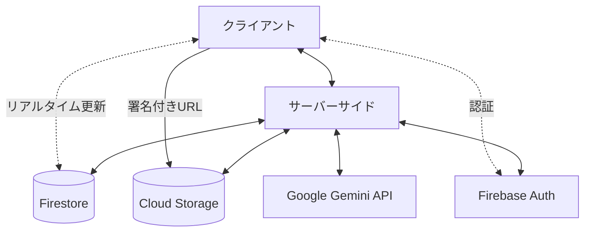
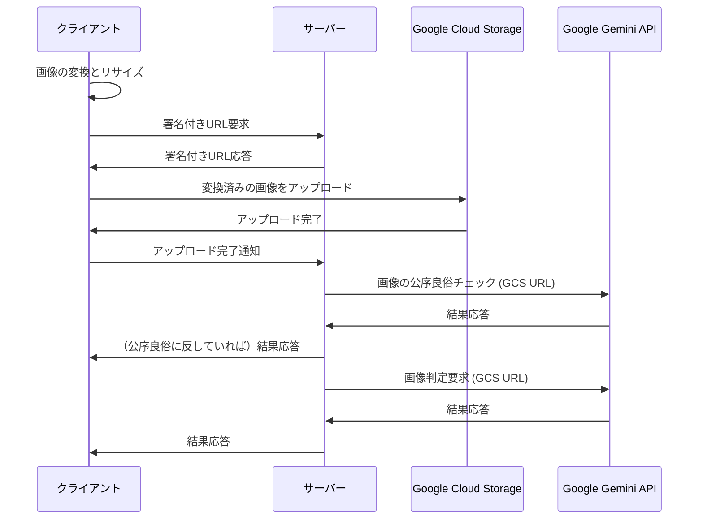

# 技術仕様書

## 技術スタック

### フロントエンド

- **フレームワーク**: Next.js (App Router)
- **言語**: TypeScript 5
- **UIライブラリ**: React 19
- **スタイリング**: Tailwind CSS 4
- **状態管理**: React Context API
- **多言語対応**: next-intl
- **Gemini API**: @google/genai
- **アニメーション**: View Transition API

### バックエンド

- **ランタイム**: Node.js 22
- **デプロイ**: Docker → Google Cloud Run
- **データベース**: Firestore
- **ストレージ**: Google Cloud Storage
- **認証**: Firebase Authentication
- **AI/ML**: Google Gemini API

### 開発ツール

- **コード品質**: Biome.js
- **テスト**: Vitest
- **コンポーネントライブラリ**: shadcn/ui
- **UI確認**: Storybook
- **Git フック**: Lefthook
- **CI/CD**: Google Cloud Build (デプロイ), GitHub Actions (テスト・静的解析)
- **分析**: Google Analytics 4

## システムアーキテクチャ

### 全体構成



### コンポーネント間の関係

- **クライアント**: ユーザーインターフェース、画像の前処理、リアルタイム更新の受信
- **サーバー**: API処理、ビジネスロジック、AIとの連携、データ検証
- **データベース**: ユーザー情報、ゲーム情報、ビンゴボード状態の保存
- **ストレージ**: 画像ファイルの保存
- **AI**: 画像判定、被写体候補生成、公序良俗チェック

## データモデル

### データモデルの実装

データモデルは以下のアプローチで実装されています：

1. **型定義とバリデーション**
   - Zodスキーマを使用した型定義とバリデーション
   - React Hook Formとの連携を考慮した設計
   - 多言語対応のエラーメッセージキー

2. **Firestoreとの連携**
   - Firestoreドキュメントインターフェースの定義
   - クライアント/サーバー間のタイムスタンプ変換
   - 型安全な変換関数の実装
   - `withConverter`を使用した型変換の自動化
   - コレクション参照関数による型安全なアクセス

3. **タイムスタンプの扱い**
   - `firebase/firestore`と`firebase-admin/firestore`の両方に対応
   - 共通インターフェース`TimestampInterface`の定義
   - 型ガード関数による安全な型変換

4. **ディレクトリ構造**

```plain
src/types/
├── common.ts       # 共通の型定義（列挙型など）
├── firestore.ts    # Firestore関連の型定義とユーティリティ
├── game.ts         # ゲーム関連の型定義と変換関数
├── index.ts        # 型定義のエクスポート
├── schema.ts       # Zodスキーマと派生型
└── user.ts         # ユーザー関連の型定義と変換関数
```

### ユーザー(users)

```yaml
/users/
  /{userId}/
    - id: string (ULID)
    - username: string (ユニークなユーザーネーム、表示名として使用、日本語も可)
    - passwordHash: string (パスワードハッシュ)
    - createdAt: timestamp
    - lastLoginAt: timestamp
    - participatingGames: array<string> (参加中のゲームID、最大5つ)
    - gameHistory: array<string> (過去に参加したゲームID)
    - memo: string (備考、管理用なのでユーザには表示されない)
    - isTestUser: boolean
    
    /notifications/
      /{notificationId}/
        - id: string (ULID)
        - type: string (通知タイプ)
        - displayType: string ("toast" または "popup")
        - message: string (表示メッセージ)
        - createdAt: timestamp
        - read: boolean (既読フラグ)
        - relatedGameId: string (関連ゲームID、該当する場合)
        - details: map (通知タイプに応じた追加情報)
```

### ゲーム参加(game_participations)

```yaml
/game_participations/
  /{participationId}/
    - userId: string (ULID)
    - gameId: string (ゲームID)
    - role: string ("creator", "admin", "participant")
    - joinedAt: timestamp
    - completedLines: number (達成した列数)
    - lastCompletedAt: timestamp (最後に列を完成させた時間)
    - submissionCount: number (画像提出回数、最大30)
```

### ゲーム(games)

```yaml
/games/
  /{gameId}/
    - id: string (6文字のアルファベット大文字、またはアルファベット大文字+数字 (ex: "TEST01")。ただし本番環境では数字を含まない形式が使用される。(ex: "ABCDEF"))
    - title: string (タイトル)
    - theme: string (場所やテーマ)
    - creatorId: string (ULID)
    - createdAt: timestamp
    - expiresAt: timestamp
    - isPublic: boolean
    - isPhotoSharingEnabled: boolean
    - requiredBingoLines: number (何列揃えたらゴールとするか、1-5)
    - confidenceThreshold: number (AIの判定確信度の閾値、デフォルト0.5)
    - notes: string (備考)
    - status: string ("active", "ended", "archived")
    
    /board/
      - cells: array<{
        id: string,
        position: {x: number, y: number} (0-4, 0-4の座標),
        subject: string (被写体の説明),
        isFree: boolean (中央のFREEセルかどうか)
      }> (ゲーム作成時に設定される共通のビンゴボード)
    
    /playerBoards/
      /{userId}/
        - userId: string (ULID)
        - cellStates: map<string, {
          isOpen: boolean (セルがOPENされているかどうか),
          openedAt: timestamp (OPENされた時刻、未OPENの場合はnull),
          openedBySubmissionId: string (OPENに至った提出ID、未OPENの場合はnull)
        }> (セルIDをキーとしたマップ)
        - completedLines: array<{
          type: string ("row", "column", "diagonal"),
          index: number (行/列のインデックス、対角線の場合は0または1),
          completedAt: timestamp (列が完成した時刻)
        }> (完成した列の情報)
    
    /participants/
      /{userId}/
        - id: string (ユーザーID)
        - joinedAt: timestamp
        - completedLines: number (達成した列数)
        - lastCompletedAt: timestamp (最後に列を完成させた時間)
        - submissionCount: number (画像提出回数、最大30)
    
    /submissions/
      /{submissionId}/
        - id: string (ULID)
        - userId: string (ULID)
        - imageUrl: string (Cloud Storageへのパス)
        - submittedAt: timestamp (アップロード完了時刻)
        - analyzedAt: timestamp (AI解析完了時刻)
        - aiResponse: string (AIの判定結果)
        - matchedCellId: string (AIが判定した合致するセルID、合致しない場合はnull)
        - confidence: number (AIの確信度)
        - processingStatus: string ("uploaded", "content_checking", "analyzing", "analyzed", "error")
        - acceptanceStatus: string (null, "accepted", "inappropriate_content", "no_match")
        - errorMessage: string (エラー発生時のメッセージ)
    
    /events/
      /{eventId}/
        - id: string (ULID)
        - type: string (例: "join", "submit", "complete_line", "complete_game")
        - userId: string (ULID)
        - timestamp: timestamp
        - details: map (イベント固有の詳細情報)
```

## API設計

### 認証API

- ユーザー登録: `/api/auth/register`
- ログイン: `/api/auth/login`
- ログアウト: `/api/auth/logout`
- ユーザー情報更新: `/api/auth/update`

### ユーザーAPI

- ユーザー情報取得: `/api/users/[userId]`
- ユーザー参加履歴取得: `/api/users/[userId]/history`
- ユーザー通知一覧取得: `/api/users/[userId]/notifications`
- 通知既読設定: `/api/users/[userId]/notifications/[notificationId]/read`
- ユーザー画像一覧取得: `/api/users/[userId]/images` (自分がアップロードした全画像)

### ゲーム管理API

- ゲーム作成: `/api/game/create`
- ゲーム情報取得: `/api/game/[gameId]`
- ゲーム参加: `/api/game/[gameId]/join`
- ゲーム設定更新: `/api/game/[gameId]/update`
- ゲーム終了: `/api/game/[gameId]/end`
- 公開ゲーム一覧取得: `/api/game/public`
- 参加中ゲーム一覧取得: `/api/game/participating`
- 管理者追加: `/api/game/[gameId]/admins/add`
- 参加者一覧取得: `/api/game/[gameId]/participants`
- 被写体候補の生成: `/api/subjects/generate`
- 被写体候補文字列の公序良俗チェック: `/api/subjects/check`

#### 候補生成プロンプト

```plain
You are the expert in suggesting specific objects or subjects suitable for a photo bingo game based on the given criteria.
Suggest **${numberOfCandidates}** distinct objects or subjects that can be photographed at the specified title and theme, matching the following conditions.
Focus on concrete nouns or short descriptive phrases that clearly identify the target for a photo.
Google Cloud Vision AI will be used to determine if a photo matches the suggested object/subject, so ensure the suggestions are visually identifiable and relatively unambiguous.
Candidates should be subjects that are not offensive to public order and morals and that are safe for children to see or approach.
If the given title or theme is offensive to public order and morals, return an error with the reason.

Candidates must respond in ${language}.

# Conditions

- Title: ${title}
- Theme: ${theme}

# Output Format

- IMPORTANT: Your response MUST be a raw JSON object WITHOUT any markdown formatting.
- DO NOT use \`\`\`json or \`\`\` markers around your response.
- Strictly output a JSON object with a single key "candidates".
- The value of "candidates" must be a JSON array of strings.
- Each string in the array should be **only the name of the object or subject** (e.g., "White seashells", "wooden bench", "fisherman"), not a full sentence instruction.
- Do not include any other explanations, introductions, or markdown. Output only the pure JSON object.

English response example for Title: Summer Camp, Theme: Campsite by the beach:

{
  "candidates": ["White seashells", "wooden bench", "fisherman", "hibiscus", "turtle", "driftwood", "barbecue grill", "propped up surfboard"]
}

Error response example for immoral title/theme:

{
  "error": "The given theme contains racist expressions."
}
```

#### 候補文字列のチェックプロンプト

T. B. D.

### 画像処理API

- 署名付きURL取得: `/api/image/getUploadUrl` (GCSへの直接アップロード用)
- 画像の公序良俗チェック: `/api/image/check`
- 画像判定処理: `/api/image/process` (画像内被写体の識別)
- ゲーム画像一覧取得: `/api/game/[gameId]/images` (写真共有設定に応じて全参加者または自分の画像のみ)
  - 自分の画像一覧: `acceptanceStatus != null && acceptanceStatus != "inappropriate_content"`
  - 他のプレイヤーの画像: `acceptanceStatus == "accepted"`
- セル画像一覧取得: `/api/game/[gameId]/cells/[cellId]/images` (特定のセルに対する画像)

#### 画像のチェックプロンプト

```plain
Please check if the given image is safe to show to the general public and return an error with the reason if there is a problem.
Output only the pure JSON object. Do not include any other explanations, introductions, or markdown like \`\`\`json ... \`\`\`.

Error response example for sexual image:

{
  "error": "This image contains sexual expressions."
}

OK response example:

{
  "ok": "This image shows a white coffee cup on a wooden desk. Steam is coming out of the coffee, indicating that the coffee is hot."
}
```

#### 画像判定プロンプト

T. B. D.

### 画像処理フロー



## リアルタイム機能

Firestoreリアルタイムリスナーを使用して、以下の機能をクライアント側で実装：

- ゲーム状態更新の監視（ビンゴボードの状態変化）
- 新規参加者の監視
- 画像提出の監視
- ビンゴ達成の監視
- 通知コレクションの監視

これらの機能はサーバーサイドAPIを介さず、クライアントから直接Firestoreにアクセスする。
Firestoreのセキュリティルールを適切に設定し、認証済みユーザーのみが必要なデータにアクセスできるようにする。

## ストレージ設計

Google Cloud Storageの階層機能を活用し、ゲームIDごとにフォルダを分けて画像を保存することでImage Listなどで列挙する際のクエリを効率化する。

画像は以下の構造で保存する:

```yaml
/pingo-images/
  /{gameId}/
    /{userId}_{submissionId}.jpg
```

## UI/UXデザイン

### デザインシステム

#### カラーパレット

基本構成色として以下の4色を使用する：

- #08d9d6 = `oklch(0.8 0.1365 192.99)` (プライマリ)
- #252a34 = `oklch(0.28 0.0198 264.19)` (フォアグラウンド)
- #ff2e63 = `oklch(0.65 0.2381 13.77)` (セカンダリ/アクセント)
- #eaeaea = `oklch(0.94 0 0)` (バックグラウンド)

これらの色は `/src/app/globals.css` でテーマ変数として定義され、各カラーのバリエーション（50-950）も用意する。

#### タイポグラフィ

- 基本フォント: 「M PLUS Rounded 1c」（丸みを帯びた可愛らしいフォント）
- コード/数字用フォント: 「M PLUS 1 Code」（ゲームIDなど等幅表示が必要な箇所）

#### レスポンシブデザイン

- モバイルファーストで設計し、Tailwind CSSの標準ブレークポイントを使用
- PCからのアクセスには背景を拡大するのみで、基本的にモバイルと同じレイアウトを適用

#### アクセシビリティ

- スクリーンリーダー対応：適切なaria属性を使用
- タッチターゲットは最低44x44pxを確保し、操作性を向上
- 色覚異常者への配慮：選定した4色のコントラスト比を確認し、WCAG AAレベルを満たす

### 画面設計

主要な画面は以下の通り：

1. トップページ (`/`)
2. ユーザー情報画面 (`/[userId]`)
3. ユーザー編集画面 (`/[userId]/edit`)
4. ゲーム作成画面 (`/create`)
5. ゲーム参加画面 (`/join`)
6. ゲーム画面 (`/game/[gameId]`)
7. ゲーム共有画面 (`/game/[gameId]/share`)
8. ゲーム結果画面 (`/game/[gameId]/result`)
9. ゲーム管理画面 (`/game/[gameId]/admin`)
10. プライバシーポリシー (`/privacy`)
11. 利用規約 (`/terms`)
12. お問い合わせ (`/contact`)
13. エラー画面 (`/error`)
14. システム管理画面 (`/config`)

### コンポーネント設計

可能な限り [shadcn/ui](https://ui.shadcn.com)を活用する。

#### 実装済みコンポーネント

##### Header

モバイルファーストで設計されたヘッダーコンポーネント。以下の機能を含む：

- 中央配置されたシステム名「Pingo」（クリックでホームページに遷移）
- 認証状態に応じた表示切り替え
  - 非ログイン時: 右上に言語切り替えボタン
  - ログイン時: 右上に通知アイコンとユーザーメニュー

##### UserMenu

ユーザーメニューコンポーネント。以下の機能を含む：

- ユーザー名の1文字目を丸く囲ったAvatarを表示
- クリックするとドロップダウンメニューを表示
  - ユーザー名
  - プロフィールリンク（Userアイコン付き）
  - 言語切り替え（Languagesアイコン付き）
  - 参加中のゲーム最新5件（存在する場合）
  - ログアウト（LogOutアイコン付き）

##### NotificationIcon

通知アイコンコンポーネント。以下の機能を含む：

- 鐘アイコンを表示
- 未読通知がある場合は右上に赤いドットでハイライト
- クリックすると画面下部からNotificationDrawerを表示

##### NotificationDrawer

通知ドロワーコンポーネント。以下の機能を含む：

- 画面下部から表示されるドロワー
- 通知一覧の表示
  - 未読通知は背景色で強調表示
  - 通知メッセージは多言語対応（ゲーム名 + 翻訳されたメッセージ）
  - 通知の日時は日付と時間の両方を表示
- 通知がない場合は「通知はありません」と表示
- 閉じるボタン

##### Footer

画面下部に固定されたフッターコンポーネント。以下の機能を含む：

- サービス利用規約へのリンク（上部に配置）
- Hacking Papa画像（[はっきんぐパパ](https://hacking-papa.com)へのリンク付き）
- 2025年固定のコピーライト表記

**実装ファイル**:

- `src/components/layout/Footer.tsx`

## トランジションとアニメーション

View Transition APIを活用したトランジションを実装する。

**ブラウザサポート状況（2025年4月現在）**:

- Chrome: サポート
- Edge: サポート
- Safari (iOS含む): サポート
- Firefox: サポートなし

**実装アプローチ**:

- View Transition APIを基本的なトランジション方法として採用
- Firefoxユーザー向けにはCSS Animationsによるフォールバックを実装
- 主要なトランジション箇所:
  - ページ間の遷移（特にゲーム参加時やゲーム結果表示時）
  - ビンゴセルのOPEN/CLOSE状態の切り替え
  - 画像アップロード時の状態変化
  - 通知の表示/非表示
  - モーダルやポップアップの表示/非表示

## セキュリティ設計

- 認証セキュリティ
  - Firebase Authenticationを使用した安全な認証
  - パスワードの強度要件を設定（最低8文字、英数字混在など）
  - ログイン試行回数の制限を実装
- データアクセス制御
  - Firestoreセキュリティルールによる厳格なアクセス制御
    - ゲーム参加者は自分のプレイヤーボードのみ更新可能
    - ゲーム管理者のみがゲーム設定を更新可能
    - 写真共有設定がオフの場合、他のプレイヤーの画像は閲覧不可
  - API保護
    - CSRFトークンを使用してクロスサイトリクエストフォージェリを防止
    - レート制限を実装し、APIの過剰な使用を防止（特に画像判定API）
    - APIキーはサーバーサイドでのみ使用し、クライアントには公開しない
    - 画像アップロードセキュリティ
      - アップロード前にクライアント側でファイルサイズと形式を検証
      - サーバー側でも再検証を行い、不正なファイルをブロック
      - 署名付きURLには短い有効期限を設定（5分程度）
      - アップロード可能なファイル形式を厳格に制限（JPG、PNG、HEICのみ）

## パフォーマンス要件

- 画像判定の応答時間: 3.0秒以内を目標、最大5.0秒まで許容
- ページロード時間: 2.0秒以内
- 一つのゲームに参加できる最大人数: 50人
- 同時アクセスユーザー数: 最大1,000人

## 多言語対応

- 日英の2ヶ国語対応
- デフォルトロケールは日本語
- 翻訳リソースはJSON形式で管理し、言語ごとにファイルを分ける
- 言語切り替えはヘッダーに配置し、選択した言語設定はCookieに保存
- 初回アクセス時はブラウザの言語設定を検出し、対応する言語があればそれを適用
- next-intlを使用した実装
  - `messages/ja.json`と`messages/en.json`に翻訳リソースを格納
  - `useTranslations`フックを使用してコンポーネント内で翻訳を取得
  - Storybookでも多言語対応が設定済み

## ID形式の統一（ULIDへの移行）

### ULIDの採用理由

ゲームID以外のすべてのIDをULIDに統一しました。ULIDを採用した理由は以下の通りです：

1. **時間的にソート可能**: ULIDは時間的に単調増加するため、データベースのインデックス効率が向上し、時系列での取得が容易になります
2. **人間にとって読みやすい**: UUIDに比べて読みやすい形式です（大文字と数字のみを使用）
3. **URL安全**: Base32エンコーディングを使用しているため、URLなどでも安全に使用できます
4. **タイムスタンプ内蔵**: 最初の10文字にミリ秒精度のタイムスタンプが埋め込まれており、作成時刻の概算が可能です
5. **コリジョン確率が低い**: UUIDと同様に実用上は衝突の心配がほぼありません

### 実装アプローチ

1. **スキーマ定義**: Zodスキーマで`z.string().ulid()`を使用してバリデーション
2. **ID生成**: `ulid()`関数を使用してIDを生成
3. **スキーマの再利用**: `userSchema.shape.id`などを使用して、一貫性のあるバリデーションを実現

### ゲームIDの例外

ゲームIDは、ユーザーが直接入力する可能性があるため、6文字のアルファベット大文字形式を維持しています。これにより、ユーザビリティを損なうことなく、システム内部で生成・管理するIDの一貫性と効率性を向上させています。

## テスト戦略

### 単体テスト

- Vitestを使用したコンポーネントの単体テスト
- テスト用プレフィックスを使用したテストデータの分離
- テスト終了時の自動クリーンアップスクリプト

### APIテスト

- Vitestを使用した実際のFirestoreとFirebase Authenticationとの連携テスト
- テスト用のユーザーデータとゲームデータを作成し、APIエンドポイントをテスト
- テスト後のデータクリーンアップを自動化
- テスト用のヘルパー関数を作成し、テストコードの重複を削減

### 統合テスト

- コンポーネント間の連携テスト
- APIエンドポイントの統合テスト
- Firestoreとの連携テスト

### E2Eテスト

- 主要なユーザーフローのE2Eテスト
- クロスブラウザテスト（特にiOS Safari）

### パフォーマンステスト

- 画像処理のパフォーマンステスト
- 同時アクセス時のパフォーマンステスト

### アクセシビリティテスト

- WCAGガイドラインに基づくアクセシビリティチェック
- スクリーンリーダーテスト

## CI/CD

- Google Cloud Buildを使用したデプロイ
  - mainブランチへのマージをトリガーとした自動デプロイ
  - Secret Managerを使用した機密情報の管理
  - cloudbuild.yamlでのbashスクリプトを使用した環境変数の適切な処理
  - Firebase認証情報（特に秘密鍵）の安全な受け渡し

### Google Cloud Buildでの環境変数と秘密情報の扱い

Google Cloud Buildでは、Secret Managerと連携して機密情報を安全に扱います。特にFirebase Admin SDKの初期化に必要な認証情報（秘密鍵など）は、以下の方法で管理しています：

1. **Secret Managerでの保存**
   - `FIREBASE_PROJECT_ID`、`FIREBASE_CLIENT_EMAIL`、`FIREBASE_PRIVATE_KEY`をSecret Managerに保存
   - 各シークレットは最新バージョン（`versions/latest`）を参照

2. **cloudbuild.yamlでの参照**
   - `secretEnv`フィールドで使用するシークレットを指定
   - `availableSecrets`セクションでSecret Managerからシークレットを取得する設定
   - bashスクリプトを使用して環境変数を適切に処理（特に改行や特殊文字を含む秘密鍵）

3. **Dockerfileでの設定**
   - ビルド引数（ARG）として認証情報を受け取る
   - 環境変数（ENV）として設定し、引用符で囲んでフォーマットを保持

4. **Firebase Admin SDKの初期化**
   - 環境変数から認証情報を取得
   - 秘密鍵の形式に応じた適切な処理（エスケープされた改行文字の置換など）

この方法により、ビルド時とランタイム時の両方で、Firebase Admin SDKが正常に初期化されるようになっています。

## 分析と監視

- Google Analytics 4を使用したユーザー行動分析
- Cloud Loggingを使用したログ収集
- Cloud Monitoringを使用したパフォーマンス監視
